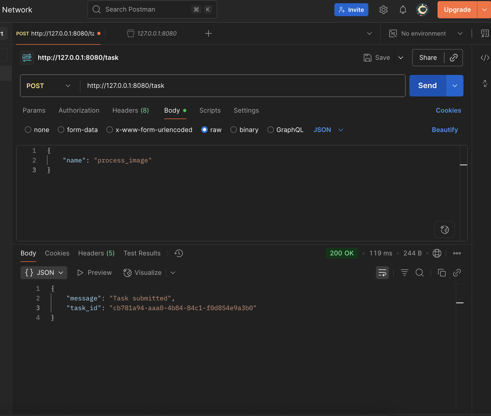
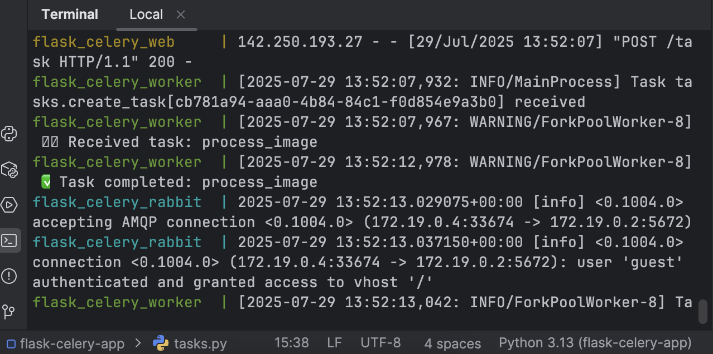
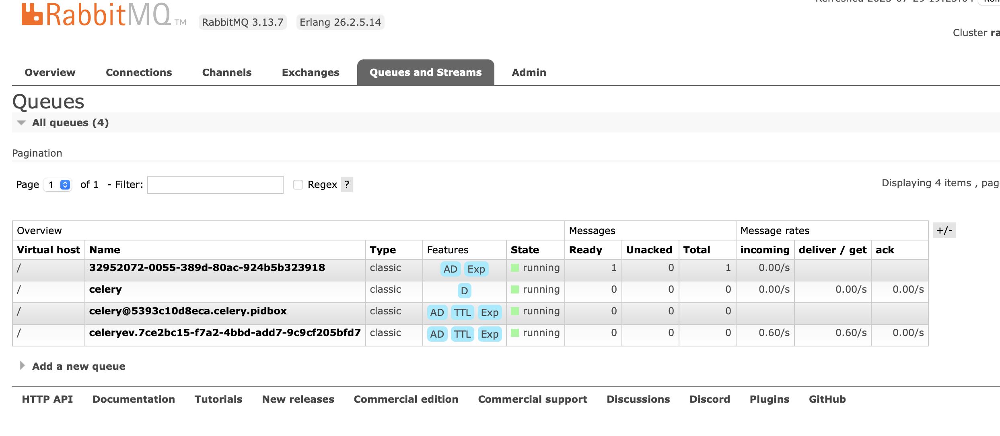

# Flask + Celery + RabbitMQ (Distributed Task Queue)

A **Flask web application** integrated with **Celery** and **RabbitMQ**  
to demonstrate **distributed asynchronous task processing** in a **multi-container Docker setup**.

---

## 🚀 Features

- Submit tasks asynchronously via `/task` endpoint
- Celery worker processes tasks in the background
- RabbitMQ acts as the message broker
- Multi-container orchestration with Docker Compose

---

### Clone Repository

```bash
git clone git@github.com:alphatushar/flask-celery-app.git
```

---

### Services
- Flask Web App (Producer) → http://127.0.0.1:5000
- Celery Worker (Consumer) → Logs processed tasks
- RabbitMQ Broker → http://127.0.0.1:15672 (guest/guest)

---

### Examples




---

### Author
Tushar Sharma